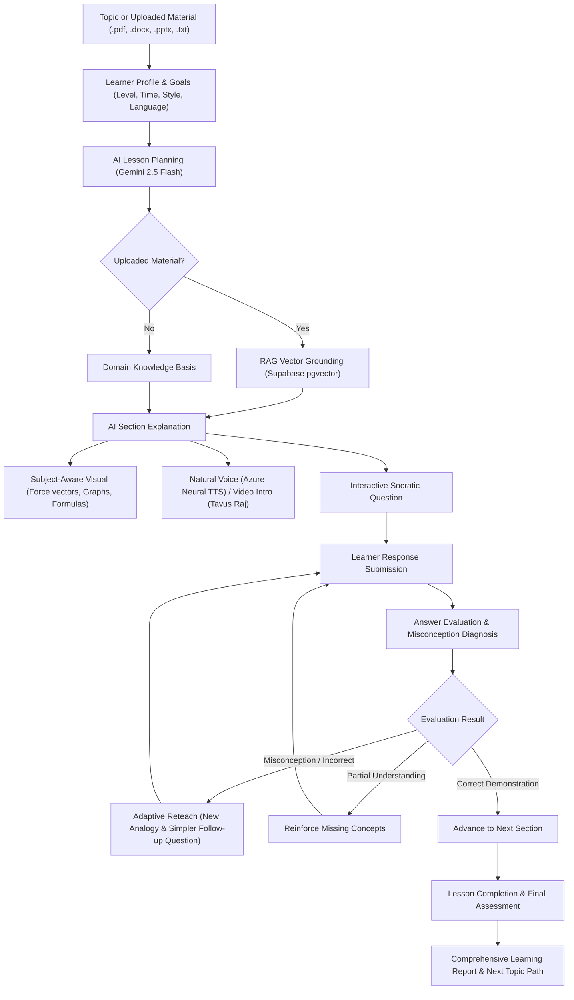

# EduMentor AI

> *"Learn anything. Your way."*

EduMentor AI is an adaptive AI Teacher that turns a topic or uploaded learning material into a personalized lesson, teaches through explanation + visuals + natural voice, checks understanding, detects misconceptions, adapts the teaching, and evaluates learning progress.

## 🚀 Live Demo

**Try EduMentor AI:** https://edumentor-ai-rouge.vercel.app/

> [!IMPORTANT]
> **Product Architecture Positioning**:  
> **Tavus provides the human-like AI Teacher video introduction. It is NOT the adaptive teaching intelligence.**  
> The actual continuous adaptive teacher is powered by:  
> **Gemini + RAG + Azure AI Speech + subject-aware visuals + evaluation + adaptive teaching logic.**

---

## 1. Problem

Most educational AI tools behave like simple chatbots:
- Student asks a prompt
- AI dumps a static answer
- Conversation ends

This passive chat model fails to replicate real pedagogical instruction. A real human tutor does not just provide raw answers—they create an interactive teaching loop:

$$\text{Understand} \longrightarrow \text{Plan} \longrightarrow \text{Explain} \longrightarrow \text{Demonstrate} \longrightarrow \text{Question} \longrightarrow \text{Evaluate} \longrightarrow \text{Adapt} \longrightarrow \text{Continue}$$

When a student struggles or demonstrates a cognitive misconception, a human teacher doesn't just repeat the exact same sentence. They diagnose the underlying confusion, switch analogies, simplify building blocks, verify understanding, and only advance once genuine mastery is achieved. EduMentor AI brings this closed-loop teaching process to digital learning.

---

## 2. Solution

EduMentor AI transforms the learning experience through an end-to-end adaptive teaching pipeline:



---

## 3. Key Features

*(Documenting strictly implemented functionality)*

- **Topic-Based Learning**: Enter any scientific, mathematical, or academic concept.
- **Multi-Format Document Ingestion**: Ingest course notes and lecture slides via `.pdf`, `.docx`, `.pptx`, and `.txt` files (`officeparser`).
- **RAG Grounding with Supabase pgvector**: 768-dimensional embeddings generated with `gemini-embedding-001` and indexed with HNSW cosine similarity.
- **Personalized Lessons**: Configure learner level (Beginner, Intermediate, Advanced), learning goals (Understand, Exam Prep, Interview), teaching styles (Conceptual, Practical, Socratic, Visual), and learning depth (Quick, Standard, Deep).
- **Time-Aware Lesson Planning**: Allocates time budgets (5, 10, 20, 30 min) across structured pedagogical sections.
- **Multilingual Support**: Full end-to-end delivery in **English**, **Hindi**, and **Hinglish** (warm conversational Hindi-English blend in Latin script).
- **AI-Generated Explanations**: Structured Gemini 2.5 Flash outputs delivering intuitive conceptual walkthroughs.
- **Subject-Aware Visuals**: Dynamic SVG diagrams, force vectors, velocity-time graphs, formulas, code snippets, and sequence timelines.
- **Natural Azure Neural Voice**: Low-latency neural speech synthesis (`en-US-JennyNeural`, `en-IN-PrabhatNeural`, `hi-IN-SwaraNeural`).
- **Human-Like Tavus AI Teacher Introduction**: Raj - Business presenter video in Section 1 with direct Mux MP4 streaming.
- **Interactive Questions**: Conceptual, multiple-choice, short-answer, and explain-in-own-words questions.
- **Semantic Answer Evaluation**: Evaluates understanding, score (0–100), missing concepts, and constructive feedback.
- **Misconception Detection**: Specifically isolates cognitive traps and faulty logic.
- **Adaptive Reteaching**: Generates a different real-world analogy and visual when a student misunderstands.
- **Follow-up Question & Re-Evaluation**: Tests the same underlying principle from a simpler perspective before advancing.
- **Final Assessment**: Multi-question test evaluating all concepts taught in the lesson.
- **Strong/Weak Concept Breakdown**: Detailed analysis of which concepts the learner mastered vs. where revision is needed.
- **Learning Report**: Comprehensive report card featuring score summaries, misconception reviews, and question breakdown.
- **Revision & Next-Topic Recommendations**: Prescribes targeted revision guidance and the next sequential topic in the curriculum path.
- **Session State**: Manages current lesson and assessment progress seamlessly in browser `sessionStorage`.

---

## 4. What Makes EduMentor AI Different

### It is Not a Chatbot
EduMentor AI does not wait passively for prompts or dump walls of text. It conducts an active, closed-loop pedagogical dialogue.

**Concrete Example**:
When a student answers an inertia question with *"The bus pushes you forward when it brakes"*:
1. The AI evaluator evaluates the answer.
2. It detects the precise misconception: *"Confusing inertia of motion with an active external forward force"*.
3. The deterministic adaptive engine triggers a **Reteach** state.
4. Gemini generates a completely **different analogy** (e.g., a skateboard hitting a curb or a coin on a card over a glass).
5. The UI updates with a fresh explanation and visual.
6. The AI asks a simpler follow-up question checking the core principle.
7. The student's follow-up answer is re-evaluated.
8. Only when conceptual understanding is demonstrated does the system advance to the next section.

### One Tavus Video Per Lesson Architecture
Unlike naive avatar wrappers that attempt to generate heavy, slow video renders for every sentence, EduMentor AI employs an intentional single-video architecture:
- **Tavus Raj - Business** is generated at most **ONCE per lesson** as the human-like introductory welcome in Section 1.
- Video generation is **asynchronous and progressive**—it never blocks lesson explanations, Azure voice, or visual interaction.
- Subsequent sections (Sections 2 and 3) and all adaptive reteach/reinforce steps use the continuous **Gemini + Azure Voice + Visuals** engine.
- This architectural separation guarantees instant responsiveness during interactive teaching while still delivering the engaging presence of a photorealistic human AI teacher introduction.

---

## 5. Architecture

- **Frontend Framework**: Next.js (App Router), React 19, TypeScript
- **Styling**: Tailwind CSS v4, Lucide React icons, shadcn/ui design patterns
- **AI & LLM Engine**: Google Gemini  via `@google/genai` (Structured Outputs with strict JSON schemas)
- **Knowledge Base & Vector Store**: Supabase PostgreSQL + `pgvector` extension with HNSW vector index
- **Embeddings**: Google `gemini-embedding-001` (768-dimensional vectors)
- **Document Ingestion**: `officeparser` (AST extraction for `.pdf`, `.docx`, `.pptx`, `.txt`)
- **Speech Synthesis**: Azure AI Speech Services (Cognitive Services Neural TTS SDK)
- **AI Avatar Presentation**: Tavus API v2 (Raj - Business replica, direct Mux MP4 streaming)
- **State Management**: Client-side `sessionStorage` with custom subscription hooks for responsive multi-step lesson flows

---

## 6. RAG Pipeline

When learners upload study notes, EduMentor AI anchors all lesson planning, teaching explanations, and evaluations in the provided source material:

```
Uploaded Document (.pdf, .docx, .pptx, .txt)
  └──> officeparser text & AST extraction
         └──> Semantic chunking (with metadata: page, slide, headings)
                └──> Gemini gemini-embedding-001 (768-dim vectors)
                       └──> Supabase document_chunks (pgvector)
                              └──> Cosine similarity search (match_document_chunks RPC)
                                     └──> Relevant chunks injected into Gemini context
```

- **Vector Specifications**: 768-dimensional embeddings generated with `gemini-embedding-001`.
- **Similarity Metric**: Cosine similarity via HNSW index (`vector_cosine_ops`).
- **Grounded Generation**: Injected source chunks instruct the lesson planner, teacher, and evaluator to strictly respect definitions and terminology in the user's material.
- **Topic-Only Flexibility**: When no document is uploaded, EduMentor AI seamlessly operates in direct topic mode, drawing upon foundational educational knowledge without failing or requiring placeholder documents.

---

## 7. Adaptive Teaching Engine

The adaptive logic in `lib/adaptive.ts` is intentionally lightweight and deterministic, ensuring consistent pedagogical rules without unpredictable multi-agent overhead:

| Student Evaluation Result | System Behavior | Next Action |
|---|---|---|
| **Correct (Score $\ge$ 80) + No Misconception** | Demonstrates mastery | **Advance** to the next curriculum section |
| **Partially Correct (Score 50–79)** | Identifies missing terms or incomplete logic | **Reinforce** concept with targeted clarification |
| **Incorrect (Score < 50)** | Demonstrates foundational gap | **Reteach** from first principles |
| **Misconception Detected** *(any score)* | Cognitive confusion identified | **Reteach** with a **different analogy/visual** + simpler question |
| **After Reteach / Reinforce** | Checks revised mental model | Re-evaluate follow-up answer before advancing |

---

## 8. AI Teacher Video Experience

- **Section 1**: Tavus Raj - Business introduces the lesson topic with human-like presence. Video generation occurs in the background and progressively enhances the card once ready.
- **Sections 2+**: The AI Teacher card transitions to **Continuous Adaptive Teaching** driven by Gemini, Azure Neural Voice, and dynamic visuals. No additional Tavus video requests are triggered.
- **Reliability & Fallback**: If live Tavus generation is unavailable (e.g., credit exhaustion HTTP 402 or network timeout), the application seamlessly serves verified language-matched introduction videos (`8eedacd381` for English, `2d90ceaa94` for Hinglish) or gracefully continues in Azure Voice mode (Hindi). Teaching is never blocked.

---

## 9. Voice and Captions

- **Azure AI Speech Neural Voices**:
  - English: `en-US-JennyNeural` (warm, articulate educator)
  - Hindi: `hi-IN-SwaraNeural` (natural Hindi cadence)
  - Hinglish: `en-IN-PrabhatNeural` (natural Indian English male voice matched to the Raj avatar presentation)
- **Synchronized Client-Side Captions**: Spoken scripts are split into readable sentence chunks and synchronized client-side with audio playback progress. *(Captions reflect the generated teaching script, not real-time speech-to-text).*
- **Dual-Audio Protection**: Playing the Tavus video automatically pauses Azure speech playback, and starting Azure voice pauses video playback, preventing audio overlap.

---

## 10. Subject-Aware Visuals

Visuals are dynamically generated and tailored to the subject matter:
- **Physics**: Interactive force vector diagrams with mass and velocity indicators, motion dynamics, and free-body representations.
- **Mathematics**: Rendered governing formulas ($F = m \cdot a$, kinematic equations), velocity-time ($v-t$) graphs with labelled axes, and step breakdowns.
- **Computer Science**: Code execution snippets and architecture blocks.
- **Science & History**: Event sequence timelines and milestone cards.

---

## 11. Personalization

Learners can personalize their learning experience on `/learn`:
- **Learner Level**: Beginner (intuitive everyday metaphors), Intermediate (rigorous conceptual framework), Advanced (formal mathematical and analytical depth).
- **Learning Goals**: Understand (exploratory), Exam Prep (test-oriented definitions and precision), Interview Prep (concise articulating and problem solving).
- **Explanation Language**: English, Hindi, or Hinglish (bilingual code-switching popular in Indian education).
- **Time Budget**: 5 min, 10 min, 20 min, or 30 min pacing.
- **Teaching Style**: Conceptual, Practical, Socratic, or Visual.
- **Depth**: Quick Overview, Standard, or Deep Dive.

---

## 12. Assessment & Learning Report

At the end of the lesson, learners take an assessment on `/assessment`:
- **Question Varieties**: Conceptual, Multiple Choice, Short Answer, Problem Solving, and Application.
- **Comprehensive Evaluation**: Every question is evaluated for correctness, partial understanding, and misconceptions.
- **Learning Report Card (`/report`)**:
  - Overall mastery percentage.
  - Categorized **Strong Concepts** vs. **Weak Concepts**.
  - Detailed **Misconceptions to Revisit** summary.
  - Question-by-question review with teacher feedback.
  - Recommended revision steps and immediate 1-click continuation to the **Next Recommended Topic**.

---

## 13. Recommended Judge Demo Scenario

Follow this exact demonstration workflow to experience EduMentor AI:

1. Navigate to `/learn`.
2. Configure the demonstration parameters:
   - **Topic**: `Newton's Laws of Motion`
   - **Level**: `Beginner`
   - **Language**: `Hinglish`
   - **Time**: `10 min`
   - **Goal**: `Exam Prep`
3. Click **Build My Lesson** $\rightarrow$ review the 3 generated sections on `/lesson`.
4. Click **Start Lesson** $\rightarrow$ enter the Teaching Room (`/teach`).
5. **Section 1 Introduction**:
   - Observe Raj - Business AI Teacher video greeting and introducing the First Law of Motion (Inertia).
   - Listen to the warm Hinglish explanation via Azure Voice (`en-IN-PrabhatNeural`).
   - Examine the dynamic inertia force vector visual.
6. **Trigger the Adaptive Loop**:
   - In response to the Section 1 question, intentionally enter a misconception answer:  
     *"Jab moving bus sudden brake lagati hai toh hum aage girte hain kyuki bus hume aage ki taraf dhakka deti hai."*
7. **Observe Misconception Detection & Reteaching**:
   - Evaluator identifies the misconception: confusing inertia with an external active force.
   - Deterministic adaptive engine switches strategy to **Reteach**.
   - Gemini generates a fresh analogy (e.g., skateboard or coin-drop) and a new visual.
   - A simpler follow-up question is presented.
8. **Demonstrate Mastery**:
   - Submit the correct answer: *"Inertia of motion ki wajah se body already moving state mein thi, bus rukne par body aage continue karna chahti hai."*
   - System evaluates as **Correct** and advances to Section 2.
9. **Complete Lesson & Assessment**:
   - Progress through Section 2 and Section 3.
   - Complete the final assessment quiz on `/assessment`.
   - View the detailed report card on `/report` showing score, concept breakdown, and next recommended topic (*"Work, Energy and Power"*).

---

## 14. Local Setup & Installation

### Prerequisites
- Node.js 20+
- npm or yarn

### Installation

```bash
# 1. Clone the repository
git clone https://github.com/25cs249-create/edumentor-ai.git
cd edumentor-ai

# 2. Install dependencies
npm install

# 3. Apply Supabase Database Migration
# Run the SQL script located in supabase/migrations/001_rag.sql
# in your Supabase SQL Editor to enable pgvector and create document_chunks table.

# 4. Configure environment variables (see below)
cp .env.example .env.local

# 5. Start development server
npm run dev
```

### Environment Variables (`.env.local`)

```env
# Supabase Configuration (Vector Database & RAG)
NEXT_PUBLIC_SUPABASE_URL=https://your-project.supabase.co
SUPABASE_SERVICE_ROLE_KEY=your-supabase-service-role-key

# Google Gemini API (LLM, Embeddings, Evaluation)
GEMINI_API_KEY=your-gemini-api-key

# Azure AI Speech (Neural Text-to-Speech)
AZURE_SPEECH_KEY=your-azure-speech-key
AZURE_SPEECH_REGION=your-azure-region

# Tavus (AI Teacher Video Avatar)
TAVUS_API_KEY=your-tavus-api-key
TAVUS_REPLICA_ID=re6220ec0195
```

> [!CAUTION]
> **Security Notice**: Never commit `.env.local` to source control. Server-side API keys (`SUPABASE_SERVICE_ROLE_KEY`, `GEMINI_API_KEY`, `AZURE_SPEECH_KEY`, `TAVUS_API_KEY`) remain strictly on the Next.js backend and are never exposed to the client browser.

---

## 15. Project Structure

```
edumentor-ai/
├── app/
│   ├── page.tsx                     # Landing page & feature showcase
│   ├── learn/page.tsx               # Lesson configuration & document upload
│   ├── lesson/page.tsx              # Curriculum overview & section breakdown
│   ├── teach/page.tsx               # Interactive Teaching Room & adaptive loop
│   ├── assessment/page.tsx          # Multi-question assessment quiz
│   ├── report/page.tsx              # Score breakdown & learning path recommendations
│   └── api/
│       ├── ingest/route.ts          # Document parsing & vector chunk storage
│       ├── rag/search/route.ts      # Semantic vector retrieval
│       ├── lesson/plan/route.ts     # Gemini lesson planner
│       ├── teach/step/route.ts      # Gemini adaptive teaching step generator
│       ├── evaluate/route.ts        # Gemini semantic answer evaluator
│       ├── adapt/route.ts           # Deterministic adaptive decision engine
│       ├── assessment/              # Assessment generation & evaluation
│       ├── tts/route.ts             # Azure Speech Neural TTS audio proxy
│       └── tavus/video/route.ts     # Tavus avatar generation & status polling
├── components/
│   ├── ai-teacher-card.tsx          # Video player, audio controller & caption sync
│   ├── visual-explanation.tsx       # Subject-aware SVG and formula renderer
│   ├── question-card.tsx            # Socratic question & answer submission
│   ├── adaptive-state.tsx           # Visual feedback banners (reteach/reinforce)
│   └── app-header.tsx               # Navigation & lesson progress indicator
├── lib/
│   ├── lesson-planner.ts            # Curriculum generation & section schemas
│   ├── teacher.ts                   # Pedagogical prompts & RAG grounding
│   ├── evaluator.ts                 # Cognitive evaluation & misconception detection
│   ├── adaptive.ts                  # Deterministic decision rules
│   ├── assessment.ts                # Assessment generator & scoring math
│   ├── rag.ts                       # Supabase pgvector insertion & RPC queries
│   ├── embeddings.ts                # Gemini gemini-embedding-001 integration
│   ├── document-parser.ts           # officeparser multi-format chunking
│   ├── tts.ts                       # Azure Speech SDK configuration
│   └── tavus.ts                     # Tavus v2 API client & verified demo fallbacks
└── supabase/
    └── migrations/
        └── 001_rag.sql              # pgvector extension, table & RPC function
```

---

## 16. Technology & Third-Party Services

| Technology / Service | Provider | Implementation Purpose |
|---|---|---|
| **Google Gemini** | Google Cloud | Lesson planning, step teaching, answer evaluation, assessment generation |
| **gemini-embedding-001** | Google Cloud | 768-dimensional text embeddings for RAG document chunks |
| **Supabase PostgreSQL** | Supabase | Relational data storage and vector chunk storage |
| **pgvector** | Open Source | Vector indexing (HNSW) and cosine similarity search |
| **officeparser** | Open Source | Server-side text and AST extraction from PDF, DOCX, PPTX, and TXT |
| **Azure AI Speech** | Microsoft Azure | Neural Text-to-Speech with multi-accent voice synthesis |
| **Tavus API v2** | Tavus | Photorealistic AI Teacher video avatar introduction (Raj - Business) |
| **Next.js (App Router)** | Vercel | Full-stack React framework with Node.js API routes |
| **Tailwind CSS v4** | Tailwind Labs | Design system tokens, styling, and dark mode teacher studio |

---

## 17. Limitations & Prototype Boundaries

- **Asynchronous Avatar Generation**: Video synthesis takes time; Tavus is intentionally designed as an introductory video rather than generating blocking videos for every spoken line.
- **Client-Side Session State**: For the hackathon prototype, lesson progression and assessment results are stored in browser `sessionStorage`. Cross-device historical analytics would require persistent database user profiles in a production release.
- **RAG Grounding**: Vector search is activated when course documents are uploaded. Without an uploaded document, lessons run on verified educational foundational knowledge.
- **External API Quotas**: Video avatar and voice synthesis availability depend on external API keys and provider credit limits; robust client and server-side fallbacks prevent any interruption to the teaching experience.

---

## 18. Hackathon Evaluation Rubric Alignment

| Assessment Category | Rubric Weight | Implemented EduMentor AI Alignment |
|---|:---:|---|
| **Human-Like Teaching & Adaptation** | 20% | Active Socratic dialogue, explicit misconception detection, deterministic adaptive reteaching with fresh analogies, and question re-evaluation. |
| **AI/ML & LLM Implementation** | 15% | Gemini 2.5 Flash with structured outputs, custom pedagogical prompts, multi-model fallback, and robust JSON schema validation. |
| **RAG Grounding** | 15% | Multi-format document parser, 768-dimensional Gemini embeddings, Supabase `pgvector` HNSW index, and grounded prompt constraints. |
| **AI Teaching Video** | 15% | Tavus Raj - Business avatar for lesson introductions, with progressive non-blocking loading and direct Mux MP4 streaming. |
| **Multilingual Capabilities** | 10% | Native support for English, Hindi, and natural Hinglish code-switching across planning, teaching, voice, and video. |
| **Voice & Avatar Integration** | 10% | Azure Neural TTS with actor-matched Indian English voice (`Prabhat`), dual-audio prevention, and synchronized client-side captions. |
| **Architectural Innovation** | 5% | Clean separation of avatar presentation (Tavus intro) from the continuous adaptive teaching engine (Gemini + RAG + Azure + Visuals). |
| **User Experience & Polish** | 5% | Studio-grade teaching card, subject-aware visualizations, real-time feedback states, and structured assessment reports. |

---

## 19. License

License: This project was created for the AI Innovation Hackathon 2026. No open-source license is currently granted.
